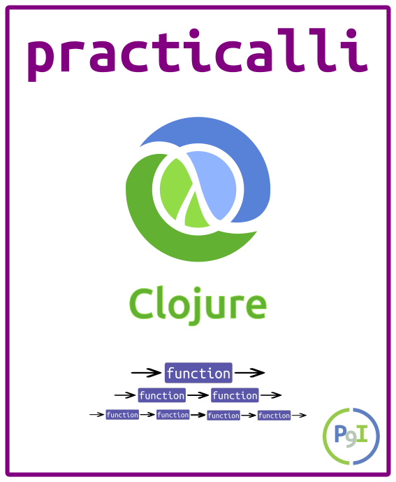

  Clojure is a simple, powerful and fun language to develop any and all applications. It has a simple syntax that is quick to learn and a wide range of Clojure libraries to build any kind of apps and services. Its also easy to use any existing Java / JVM Language code or libraries as part of your Clojure apps.

In this workshop we take a hands on approach where everyone takes Clojure code and experiments with it using the REPL (interactive runtime environment). You will quickly get a feel for Clojure by evaluating, breaking, fixing and extending code in the REPL, all the while getting instant feedback on what your code is doing.

As we work through code we will discuss the concepts behind Clojure, including functional programming, "pure" functions and a stateless approach with persistent data structures, changing state safely, Java interoperability and tooling around Clojure.

Get a [free Clojurians slack community account](https://clojurians.net/)

> #### Warning::Book refresh in progress
> A refresh of the contents of this book is currently underway, so things may.

## Supporting Resources

**Workshop**
* [Getting started with Clojure](http://jr0cket.co.uk/slides/getting-started-with-clojure.html)
* [Clojure through code](https://github.com/practicalli/clojure-through-code) - sample code to support this project
* [Lighttable Koans](https://github.com/practicalli/lighttable-koans) - exercises to help you discover Clojure
* [Clojure Webapp workshop](http://practicalli.github.io/clojure-webapps/) - building server-side webapps in Clojure

**Learning Clojure**
* [Clojure.org](http://clojure.org), [features](http://clojure.org/features) and [rational](http://clojure.org/rationale)
* [Clojure documentation](http://clojure.org/documentation)
* [Clojure cheetsheet](http://clojure.org/cheatsheet)
* [Official Clojure Google group](https://groups.google.com/forum/#!forum/clojure)
* [CrossClj](http://crossclj.info/) - cross-referencing the Clojure ecosystem
* [Brave Clojure](http://www.braveclojure.com/)

> **Hint** There are over 20 excellent [books published on Clojure](reference/books.html) that go into detailed theory behind the language

**Community**
* [Clojure-docs](http://clojure-doc.org/) - community docs
* [Clojars]() and [CrossCLJ](http://crossclj.info/) - cross-referencing the Clojure ecosystem
* [re-find (borkdude)](https://borkdude.github.io/re-find.web/) - find functions from arguments and return values
* [Clojure & ClojureScript Dependencies](https://clj-deps.herokuapp.com/)
* [4Clojure](https://www.4clojure.com/) exercises & [4Clojure Google group](https://groups.google.com/forum/#!forum/4clojure)
* [ClojureScript REPL](http://www.clojurescript.io/) - website REPL
* [LambdaX](http://lambdax.io/blog/)
* [London Clojurians]() and their [Google group](https://groups.google.com/forum/#!forum/london-clojurians)
* [Uncle Bob presents Clojure](https://www.youtube.com/watch?v=SYeDxWKftfA)
* [Snake Game in Clojure](https://fn-code.blogspot.co.uk/2015/08/a-clojure-snake-game.html)
* [Clojure design patterns](http://mishadoff.com/blog/clojure-design-patterns/)

This work is licensed under a Creative Commons Attribution 4.0 ShareAlike License (including images & stylesheets).

 Clojure, Practicalli by <a xmlns:cc="http://creativecommons.org/ns#" href="spacemacs.practical.li" property="cc:attributionName" rel="cc:attributionURL">Practicalli</a> is licensed under a <a rel="license" href="http://creativecommons.org/licenses/by-sa/4.0/">Creative Commons Attribution-ShareAlike 4.0 International License</a>. Based on a work at <a xmlns:dct="http://purl.org/dc/terms/" href="https://github.com/practicalli/clojure" rel="dct:source">Clojure, Practicalli on Gitub</a>. Permissions beyond the scope of this license may be available at <a xmlns:cc="http://creativecommons.org/ns#" href="https://twitter.com/practical_li" rel="cc:morePermissions">@practical_li</a>.
