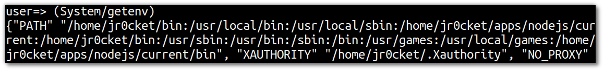

# Java Interoperability

  Clojure provides very clear and simple syntax for [Java interoperatility](http://clojure.org/java_interop), using the functions such as `. new import`
  
  As Clojure is a hosted language on the JVM, its very easy to include any library from other languages that also run on the JVM, i.e. Java, Groovy, Scala, Jython, JRuby, etc.
  
  The Leiningen build tool provides a simple way to include libraries as dependencies, using the `:dependencies` section of the `project.clj` file.  [Maven Central](http://search.maven.org/) is one of the default repositories libraries are pulled from, the other being [Clojars.org](https://clojars.org). 
  
  Clojure includes the `java.lang` library automatically, so you can call any methods from that library without having to import them or include any dependencies

## The syntax 

  Its very easy to call Java methods and objects from clojure using the following syntax

```clojure
(.instanceMember instance args*)
(.instanceMember Classname args*)
(.-instanceField instance)
(Classname/staticMethod args*)
Classname/staticField
```

> **Note** Convert a string to upper case & show the approximate version of Pi

```clojure
(.toUpperCase "I was low, but now I'm up")


Math/PI
-> 3.141592653589793
```

## Getting the Java environment

  Eariler we used Clojure functions to find information about our environment.  We can also used the `getProperty()` method from the `java.lang.System` object to ask for the _java version_ and _jvm name_.


> **Note** Get version of Java & the JVM, returning those values as a meaningful string.  Then get the version of the Clojure project

```clojure
(str "You are running Java version " (System/getProperty "java.version") "with the JVM" (System/getProperty "java.vm.name")) 

(str "Latest project version: " (System/getProperty "playground.version"))
```

> **Note** Use `System/getenv` to return your system's environment variables as a map

```clojure
(System/getenv)
```




  You may notice that this is a map data structure that we return, so we can use use destructuring or the maps behaviour itself to pull out information. 


> **Hint** A full list of properties can be seen in the [getProperty() documentation](http://docs.oracle.com/javase/8/docs/api/java/lang/System.html)

  There are more examples of Java Interoperability in the next few sections.
