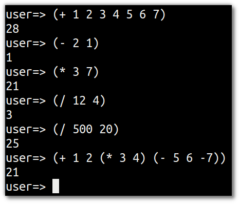
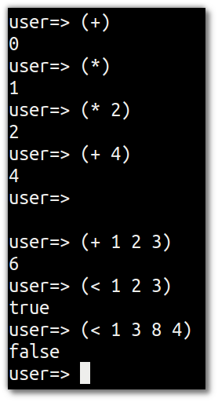

# Maths

  Writing some simple mathematics helps you get used to the form of Clojure.  Unlike other languages, Clojure does not have operators for mathematics.  Instead `+ - * /` are all functions in their own right.
  
  As Clojure uses pre-fix notation then mathematical expressions are always unambiguous.

> **Note** Write some simple math to help you get used to the form of Clojure

```clojure
(+ 1 2 3 4 5 6 7) 
(- 2 1)
(* 3 7)
(/ 12 4)
(/ 500 20)
(+ 1 2 (* 3 4) (- 5 6 -7))
```



## Variable numbers of arguments

  Mathematic functions show the flexibility of Clojure, as they take a variable number of arguments (variadic functions).  Its common for Clojure functions to have zero, one or many arguments (many arguments typically represented as a built-in data structure (map, vector, set or list)

> **Note** Write some more maths to show the variadic nature of mathematic (and manu other) functions

```clojure
(+)
(*)
(* 2)
(+ 4)

(+ 1 2 3)
(< 1 2 3)
(< 1 3 8 4)
```



> **Note** Explore some number related functions 

```clojure
(rem 22 7)
(mod 20 12)
(quot 13 4)

(inc 3)
(dec 4)

(min 1 2 3 5 8 13)
(max 1 2 3 5 8 13)

(repeat 4 9)

(range 10)
(range 18 66)
(range 2 99 2)
```

> **Note** Explore what equality means in Clojure.  Equality is very useful when your data structures are immutable

```clojure
(= 1 1) 
(= 2 1) 

(identical? "foo" "bar")
(identical? "foo" "foo")
(= "foo" "bar")
(= "foo" "foo")

(identical? :foo :bar)
(identical? :foo :foo)

(true)
(false)
(not true)
(true? (= 1 1))
(false (= 1 -1)) 
```
---

;; Move to a section on functions 

(apply + [1 2 3])

(apply / [1 2 3])
(/ 53)

(map + [1 2 3.0] [4.0 5 6])

