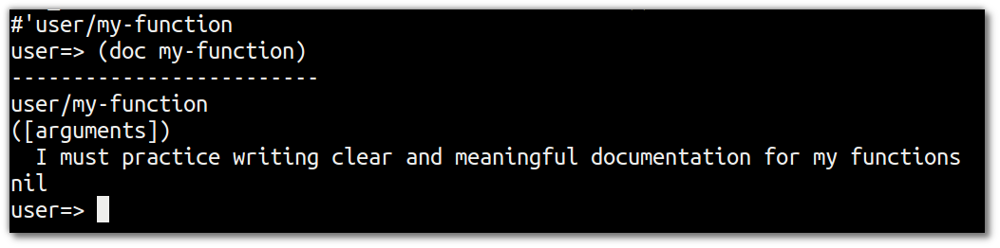
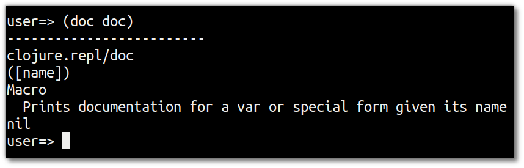
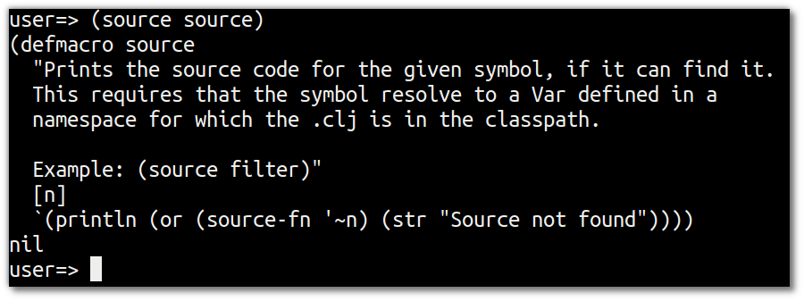

# Show me the docs

  Any Clojure aware editor will show the syntax of a function as you add it to your code.  It should also show you the documenation and source code for a function too, so you can understand what it does and how it works.

  Clojure functions are documented by adding a string to the function definition.  This is refered to as the **doc string**.
  
```
(defn example-function
  "This is the documentation for this function, refered to as a doc string"
  [arguments]
  (str "some behaviour"))
```

> **Hint** Reading the source code for some of the commonly used functions in `clojure.core` is a great way to discover how to write Clojure


## Writing your own documentation 

Writing good documentation for your own functions take practice which pays off in the long run.

> **Note** Write your own function and practice writing a meaningful documentation in the doc string

<!--sec data-title="Reveal answer..." data-id="answer001" data-collapse=true ces-->

```clojure
(defn my-function 
  "I must practice writing clear and meaningful documentation for my functions"
  [arguments]
  (str "I should wrie better functions too"))
```


<!--endsec-->

<hr />

## The doc & source functions 

If you are not using a Clojure aware editor or spend a lot of time in the REPL you can also view the documenation of a function by calling the `doc` function and see the source by calling the `source` function.

To use the `doc` & `source` functions in the REPL you should be in the `user` namespace.


> **Note** On the command line, start a REPL with the command `lein repl` and then view the documentation for three common functions used in clojure

Make sure you are in the `user` namespace before calling the `doc` function.  If you are in another namespace, either change back using `(ns 'user)` or see the next section on using these functions in another namespace.

```clojure
(doc doc)
(doc map)
(doc filter)
(doc cons)

(source doc)
(source map)
```

  Here is the doc string for `doc`



  Here is the source code for the `source` function
  

  
 > **Hint** As the documentaiton for a function is part of its definition, by looking at the source of a function you also get the documentation.
 

## Using doc & source function from another namespace 

  The `doc` and `source` functions are only included in the `user` namespace. If you switch to another namespace or your editor places you in the current namespace of your project, these funcitons will not be available unless you including `core.repl` in the current namespace.
  
  
From the REPL, evaluate the expression: 

```
(use 'clojure.repl)
```

You could also `require` the `clojure.repl` library in your own code, however if you have a good editor it should provide these features without including this library.  Therefore the following code is shown only as an example and not a recommended approch.

```
(ns foobar
(:require [clojure.repl :refer :all]))
```
