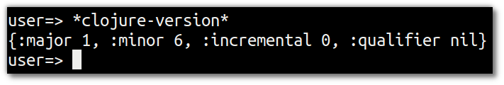
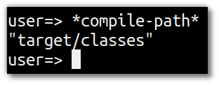
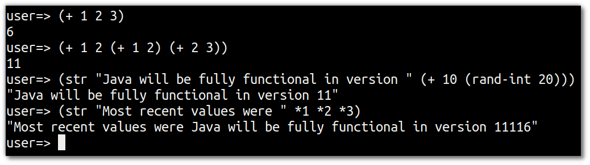

# Whats my environment

  Clojure has **symbols** (names that point to values).  Some of these symbols are built into the language and their names start (and usually end with) the `*` character.

  When symbols are evaluated they return the value that they point to.


> **Note** Check the version of Clojure running in your REPL.  

  Enter the following code into the Clojure REPL:
  
```clojure
*clojure-version*
```



  The full clojure version can be used to check you are running a particular version, major or minor of Clojure core.  This information is represented as a map containing `:major`, `:minor`, `:incremental` and `:qualifier` keys.    Feature releases may increment :minor and/or :major, bugfix releases will increment :incremental.  Possible values of :qualifier include "GA", "SNAPSHOT", "RC-x" "BETA-x"

> **Hint** A map in Clojure is a built in data structure represented by `{ }`. A map is a key-value pair and there must be a value for every key for the map to be valid.  Keys are often defined using `:keyword`, a self-referential pointer that can be used to look up values in a map or other data structures.


## Viewing the Class path

  Clojure compiles to Java bytecode that runs on the JVM, so that code needs to be available in the Java class path.

> **Note** Look at the class path for your project

  The directory where the Clojure compiler will create the .class files for the current project.  All .class files must be on the class path otherwise the Clojure run time environment will not know they exist.


```clojure
*compile-path*
```




## Namespace

  A **namespace** in clojure is a way to seperate functions and data structures into logical components (similar to Java packages).  A `clojure.lang.Namespace` object representing the current namespace.
  
> **Note** Find out the current namespace 

```clojure
*ns*
```


## Last 3 values in the REPL

  You can also get the 3 most most recent values returned in the REPL.  
  
> **Note** Evaluate the following three expressions in the REPL, then pull out the last three results
  
```clojure
(+ 1 2 3)

(+ 1 2 (+ 1 2) (+ 2 3))

(str "Java will be fully functional in version " (+ 10 (rand-int 20))
```

  Now get the last three values returned in the REPL

```clojure
(str *1 *2 *3)
```




> **Hint** You can cycle through previous expressions entered into the REPL using the `Shift-UpArrow` keyboard shortcut
