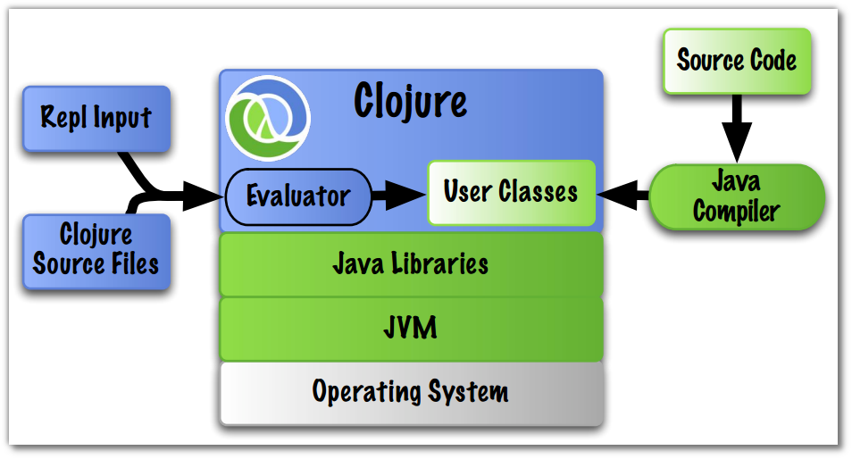

# Its all Bytecode in the end

> The REPL is your compiler

  As soon as you evaluate your code in the REPL it is also being compiled in the background into Java Bytecode.  So there is no need for a seperate build and run phase.

  Injecting code into the running environment provides the means for fast iterative development of code.
