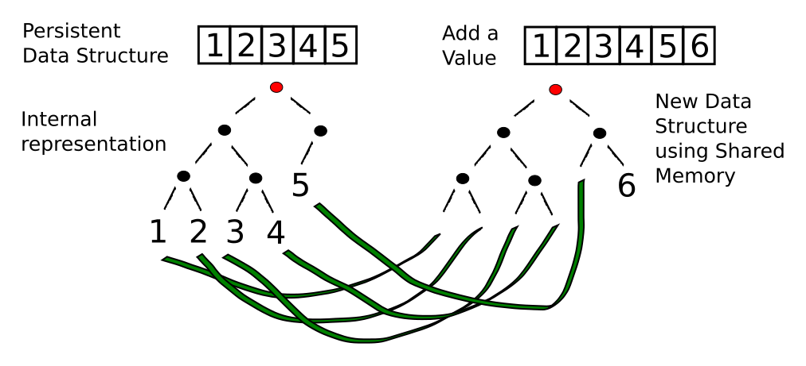

# Data structures

  Clojure is a very data centric language.  It has many functions for manipulating data structures and has some very powerful built in data structures, refered to as collections (or sequences).
  
  Collections can take any types of elements and types can be mixed.  Collections can even have other collections as an element.

## Collections

So far, we've dealt with discrete pieces of data: one number, one string, one value. When programming, it is more often the case that you want to work with groups of data. Clojure has great facilities for working with these groups, or _collections_, of data. Not only does it provide four different types of collections, but it also provides a uniform way to use all of these collections together.

* Collections
  * Lists - a linked list, sequential access
  * Vectors - an indexed array
  * Maps - key-value pair (hash map)
  * Sets - a unqiue set of values

## Persistent data structures 

  The collections in Clojure are immutable, so they initially seem similar to constants rather than variables.  Once a collection is created, it cannot be changed.  Any functions that run on a collection do not change the collection, instead they return a new collection with the respective changes.
  
  Creating a new collection each time may seem inefficient, however, the persistent collections use a sharing model.  When a new collection is created, it links to all the relevant elements of the original collection and adds any new elements.

> **Hint** Read the InfoQ article on [An In-Depth Look at Clojure Collections](http://www.infoq.com/articles/in-depth-look-clojure-collections).
