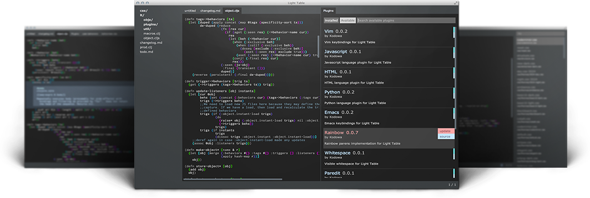

# LightTable

This workshop will use LightTable to help you discover Clojure.

 I have found LightTable to be one of the best tools to help you learn Clojure, especially the highly interactive Instarepl that evaluates your Clojure code as you type.

  LightTable is a modern development tool that supports Clojure, ClojureScript, JavaScript and Python languages.  The tool is open source and written in Clojure & ClojureScript (with a little JavaScript & CSS)



> **Note** Install Lighttable from [lighttable.com](http://lighttable.com)

**Linux** 
  Extract the contents of the downloaded lighttable file to a suitable directory (`/usr/local` or `/opt` or `~/apps`).  Make sure the `LightTable` file in the extracted folder is accessible via the system `$PATH`.

**MacOSX**
  Install the `lighttable.dmg` file just as any other MacOSX package

**Windows**
  Download the windows zip file for LightTable and extract the installer, following the instructions inside the installer.

## Useful LightTable configurations

  Open the user behaviours file, `Ctrl-space user behaviors` and add any of the following configurations

This opens the User Behaviours file for editing.  When you save the file, `Ctrl-s`, changes are applied immediately.  Add any of the following options you wish:

**Open Workspace on startup**
Show the workspace browser when you run LightTable, so you can see all the projects you have added and open files easily.
> `[:app :lt.objs.sidebar.workspace/workspace.open-on-start]`


**automatic closing of parentesses**
[Enabling auto-closing parens.](http://stackoverflow.com/questions/27818505/light-table-parentheses-are-not-auto-closing) - not recommended for non-English keyboard layouts
> `[:app :lt.objs.settings/pair-keymap-diffs]`


**show line numbers**
> `[:editor :lt.objs.editor/line-numbers]`

**don't wrap lines**
Dont wrap a line of text around if they are to long for the screen:
> `[:editor :lt.objs.editor/no-wrap]`


**Sample User Behaviours file**
```
[
 ;; The app tag is kind of like global scope. You assign behaviors that affect
 ;; all of Light Table to it.
 [:app :lt.objs.style/set-skin "dark"]
 [:app :lt.objs.plugins/load-js "user_compiled.js"]

 ;; The editor tag is applied to all editors
 [:editor :lt.objs.editor/no-wrap]
 [:editor :lt.objs.style/set-theme "default"]
 [:editor :lt.objs.style/font-settings "Sans" 16 1.2]
 [:app :lt.objs.settings/pair-keymap-diffs]
 [:editor :lt.objs.editor/line-numbers]

 ;; Here we can add behaviors to just clojure editors
 [:editor.clojure :lt.plugins.clojure/print-length 1000]

 ;; Behaviors specific to a user-defined object
 [:user.hello :lt.plugins.user/on-close-destroy]

 ;; To subtract a behavior, prefix the name with '-' e.g.
 ;; [:app :-lt.objs.intro/show-intro]
]
```

## Using LightTable 

  LightTable has an online tutorial entitled [Getting started with LightTable](http://docs.lighttable.com/tutorials/full/)


  I mainly use the Instarepl in LightTable.  I create a project first with Leiningen, open the project directory in the LightTable workspace and oopen any files I want to work with.  I then connect the open editor window for the file to an Instarepl.

> **Hint** my approach is documented in the [quick demo section of my Clojure & LightTable slides](http://jr0cket.co.uk/slides/jax-london-2013-light-table.html#/sec-12) from JAXLondon 2013.  This should be pulled into this workshop into its own section
