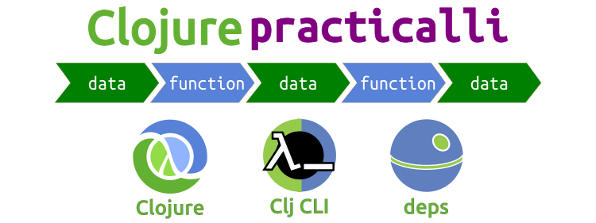

  **Clojure is an elegant language for a more civilized development experience**.

  A simple syntax means Clojure is quick to learn and a wide range of open source libraries provides a rapid way to build any kind of software. Designed as a hosted language, Clojure runs on many platforms including the Java Virtual Machine, GraalVM, Microsoft.Net, JavaScript engines.  Simple host language interoperability provides access to libraries from a wide range of programming languages, further extending the reach of Clojure.

> #### Hint::Quote: Adrian Cockcroft. Cloud Architect, Netflix
> "A lot of the best programmers and the most productive programmers I know are writing everything in Clojure and swearing by it, and then just producing ridiculously sophisticated things in a very short time. And that programmer productivity matters." Adrian Cockcroft - Battery ventures, formally Cloud Architect, Netflix

## Clojure REPL Driven Development

Clojure runs in [a REPL process](repl-driven-devlopment.md) that provides instant feedback as code is written, encouraging experimentation and allowing effective designs to evolve rapidly and with confidence that comes with a clear understanding.

The REPL is the [Clojure interactive environment](repl-driven-devlopment.md) used to create an run Clojure code, in both development and production.  Quickly grow confidence with Clojure by evaluating, breaking, fixing and extending code in the REPL.  All the while getting instant feedback on what the code is doing.

## About the book
Practicalli Clojure provides a hands on approach to learning Clojure through the entire development workflow.

As we work through code we will discuss the concepts behind Clojure, including functional programming, "pure" functions and a stateless approach with persistent data structures, changing state safely, Java interoperability and tooling around Clojure.

## Resources
* [practicalli/clojure-deps-edn - Clojure tools and common aliases]({{ book.P9IClojureDepsEdn }})
* [Practicalli Spacemacs](https://practical.li/spacemacs) and [practicalli/spacemacs.d](https://github.com/practicalli/spacemacs.d) for Vim style editing in Emacs for Clojure.
* [Practicalli YouTube channel](https://youtube.co/c/+practicalli) - 80+ hours of Clojure related videos
* [Practicalli website]({{ book.P9IWebsite }}) books and videos to support your journey into Clojure
* [Practicalli Graphic design]({{ book.P9IGraphicDesign }}) - Creative Commons Attribution

## Discussions and feedback
[Contributions are welcome via GitHub issues and pull requests](contributing.md), or discuss the book on the Clojurians Slack community.

Get a [free Clojurians slack community account](https://clojurians.net/)

> #### Warning::Content regularly added to this book
> Content is usually added daily, recommend using the search box at the top of the content navigation if you cant find what you are looking for.
> Last published: {{ gitbook.time }}

## Creative commons license

<a rel="cc:attributionURL" href="https://practicalli.github.io/clojure/">Practicalli Clojure</a> by <a rel="cc:attributionURL" href="https://practicalli.github.io/">Practicalli</a> Creative Commons Attribution Share-Alike 4.0 International

