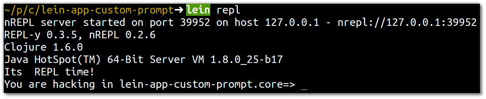
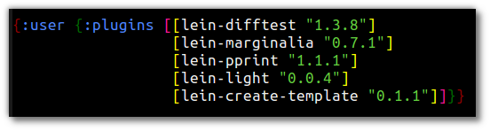
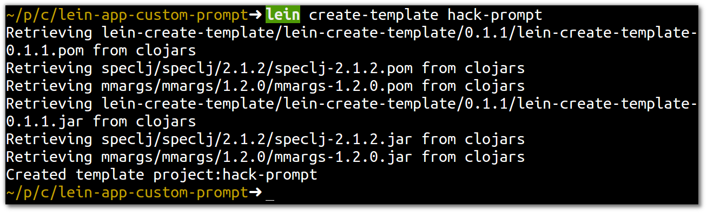
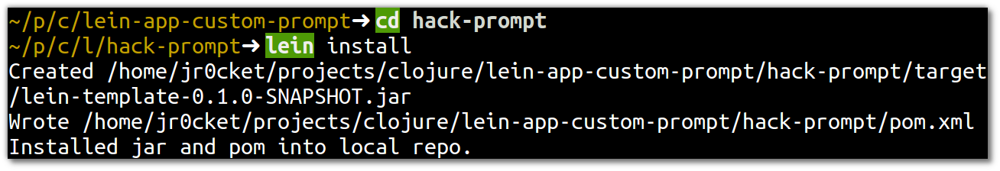
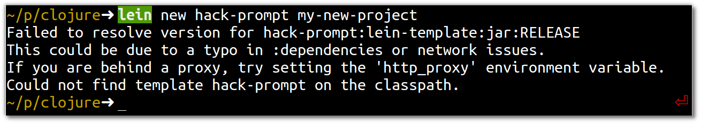

# Create a custom template 

> **fixme** The following instructions currently reslut in a broken template, missing version, so this section is under investigation.

---

> **Note** Create a template that customises the REPL prompt that changes the welcome message you see when the REPL first starts, as well as changing the prompt to output a message followed by the current namespace

#### Create a new project as a base for the template

  Create a new project with leiningen 
  
    lein new app lein-app-custom-prompt

  Edit the `project.clj` file in the root of the new project and add the `:repl-options`customisation.

```clojure
:repl-options {
    prompt (fn [ns] (str "You are hacking in " ns "=> " ))
    :welcome (println "Its  REPL time!")}
```

  When you run `lein repl` inside the project, the prompt should now look like:




#### Create a new template

  Add the Leining plugin called `lein-create-template` to your user-wide profile by adding the following line to the file `~/.lein/profiles.clj`
  
    {:user {:plugins [[lein-create-template "0.1.1"]]}}

  The file should look similar to the following, depending on which other plugins are already added:



  Inside the new project you created as a base for you template, run the command 

    lein create-template hack-prompt



    lein install 



    lein new hack-prompt my-new-project



> **fixme** something has gone wrong with the creation of the template, missing a version number.  Check the files created in the original project and in the ~/.m2 directory.  I wonder if it is because the original project had a snapshot for the version.

--- 


> **Hint** I created further customisations to the prompt in the article [add colour to your clojure repl](http://jr0cket.co.uk/2013/08/add-colour-to-your-clojure-repl-with.html.html)
