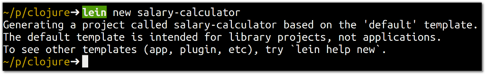
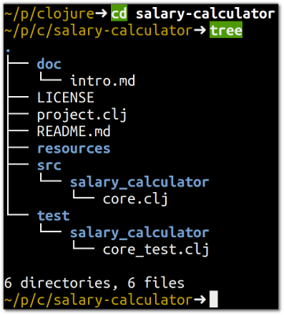
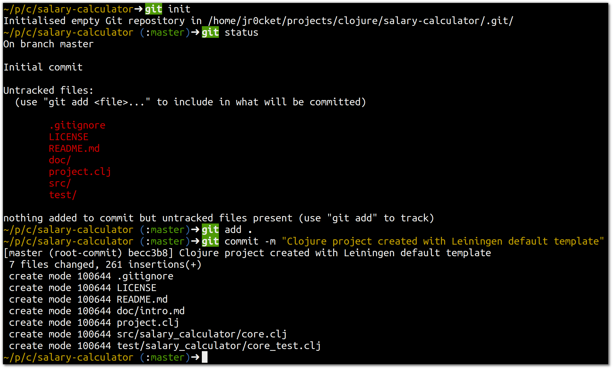

# Create a project

> **Note** Create a project called salary-calculator using Leinging 
  
```clojure
lein new salary-calculator
```

This creates a new directory with the name of the project.  We did not specify a project template, so Leiningen just used the default template.  




## Viewing the Clojure project structure 

  Change into the directory created by Leiningen and view the directory structure (here we use the command `tree`, you can use a file manager or editor if you prefer).



> **Hint** Clojure uses Kebab-case for its naming conventions (think of a shish-kebab), however the Java runtime does not like minus symbol, `-`, in directory or file names.  Therefore as there is a `-` symbol in the project name, Leiningen automatically changes the directory name to use the underscore `_` symbol instead. 


## Version the project with Git (optional)

> **Hint** If you have already cloned the project from Github, skip this step

  Even when experimenting with a new language its good to put your code into version control, so you can experiment freely and go back to alternative ideas.

> **Note**  Run the following Git commands within the root of the Clojure project (the directory containing project.clj)

```
git init

git add .

git commit -m "Clojure project created with Leiningen default template"
```

Command output should look similar to the following: 



