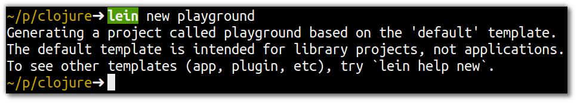

# Some Basic Clojure

  In this section we will evaluate some code so you can get familiar with the syntax and basic constructs of Clojure.  It will also help ensure that your development environment is working okay.

  
> **Note** Create a project using the Clojure build tool Leiningen to explore some basic Clojure code

  Run the following command to create a project (you can use a different name to playground if you prefer)

```
lein new playground
``` 



> **Note** Run a Clojure REPL to have the run-time enviroment for Clojure 

```
lein repl
``` 


  Now you are ready to enter Clojure code...
