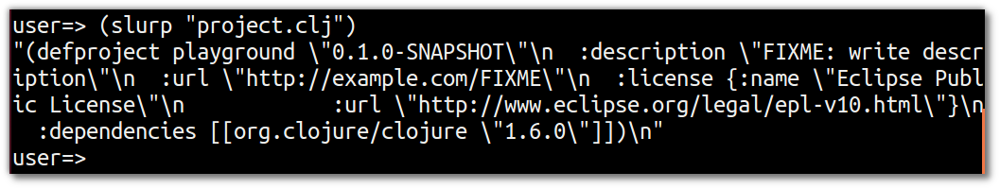
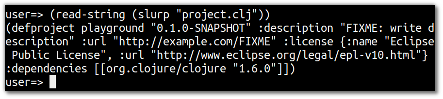
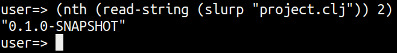

# Reading your Project configuration

  Information about our Clojure project is contained within our `project.clj` file.  We can read in this file and check the project information in that way.

  The `slurp` function reads in the contents of a file or content from a web page / URL. 


> **Note** Read the Clojure `project.clj` file using the `slurp` function

```clojure
(slurp "project.clj")
```

  The output of slurping the project file should similar to the following 




> **Note** Tidy up the result of the `slurp` value using the function `read-string`

```clojure
(read-string (slurp "project.clj"))
```



## Just the project version

  Really we just want to get the project version, not all the information.  As a list is returned from `slurp` and `read-string` then we can simply wrap a function around the first two functions to get the value we want

  The `nth` funtion takes the data structure as the first argument and the element number (starting from zero) as the second argument.

> **Note**   Use the `nth` function with `read-string` and `slurp` to select the element we actually want.

```clojure
(nth (read-string (slurp "project.clj")) 2)
```



  
